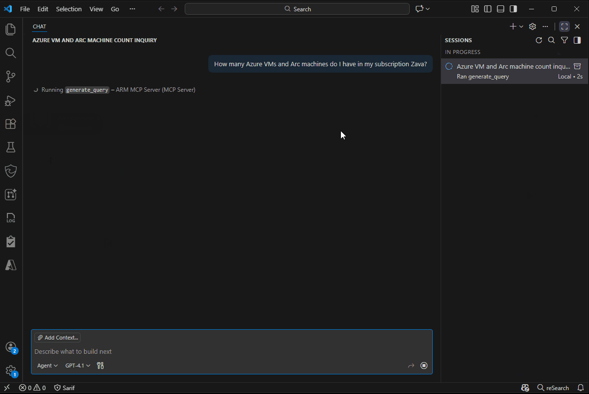

# Azure Resource Manager MCP server

This is a repository to track features, bugs, and suggestions for the Azure Resource Manager MCP server.

## Overview
Azure Resource Manager (ARM) is the control plane of Azure. Every operation that creates, updates,
or deletes Azure resources flows through ARM, regardless of whether it comes from the Azure portal,
CLI, PowerShell, REST APIs, or SDKs.

AI agents introduce a new kind of Azure client that needs a consistent, centralized way to interact
with ARM. The **Azure Resource Manager MCP server** is designed to provide that access layer through the Model
Context Protocol (MCP), the standard protocol agents use to perform actions and retrieve dynamic
data.

Today, the **Azure Resource Manager MCP server** equips agents with tools to query Azure resources,
deploy and manage ARM templates, create or update resources, inspect resource type schemas, and
analyze Azure costs and pricing. Its core purpose is to enable AI agents to interact with Azure
resources seamlessly, just like other ARM clients. More capabilities will be added in the future.

## Features
The **Azure Resource Manager MCP server** provides the following key features:
- Generate ARG queries dynamically based on user or agent input.
- Validate ARG queries for correctness and security.
- Execute ARG queries against your Azure environment.
- Preview, create, monitor, and cancel ARM template deployments.
- Create or update Azure resources and resource groups.
- Discover Azure resource types, API versions, and schemas.
- Query Azure costs, AKS costs, retail prices, and negotiated pricesheets.

The following tools and schemas are currently registered by the Azure Resource Manager MCP server.
Fields marked optional can be omitted.

| Tool | Input | Output | Description |
|------|-------|--------|-------------|
| `create_deployment` | `request.targetScope`: `subscriptionId`, `resourceGroupName`, `deploymentName`; `request.definition.properties`: `mode` (`Incremental`), ARM `template`, optional `parameters`, optional `validationLevel` (`Template`, `Provider`, or `ProviderNoRbac`) | ARM deployment initiation response; monitor it with `get_deployment_status` | Deploys an ARM template to an Azure resource group. |
| `whatif_deployment` | Same target scope and deployment definition as `create_deployment`; optional `whatIfSettings.resultFormat` (`ResourceIdOnly` or `FullResourcePayloads`) | Predicted resource changes; long-running requests can return `locationHeaderUrl` for polling | Previews the changes an ARM template deployment would make. |
| `get_deployment_status` | `request`: `subscriptionId`, `resourceGroupName`, `deploymentName` | Current deployment status, result, and any deployment errors | Gets the current status and result of an ARM deployment. |
| `cancel_deployment` | `request`: `subscriptionId`, `resourceGroupName`, `deploymentName` | ARM cancellation response | Cancels an ARM deployment that is currently running. |
| `get_async_operation_status` | `locationHeaderUrl` from an asynchronous resource or what-if response | `202` while in progress; terminal `200` response with the operation result | Checks the status of a long-running ARM resource operation. Do not use it for `create_deployment`; use `get_deployment_status`. |
| `create_or_update_resource` | `request.scope`: scope `type` plus identifiers required by that scope; `providerNamespace`, ordered `resourceSegments` (`resourceType`, `resourceName`), `apiVersion`, and resource `body` | ARM `PUT` response; asynchronous operations include `locationHeaderUrl` for polling | Creates or updates a single Azure resource at tenant, management group, subscription, resource group, or resource scope. |
| `create_or_update_resource_group` | `request.scope.subscriptionId`, `resourceGroupName`, and `definition.location`; optional `definition.tags` | Created or updated resource group | Creates or updates an Azure resource group, including its location and tags. |
| `list_resource_types` | None | Available Azure resource types and their latest API versions | Lists resource types that can be used in ARM templates and direct ARM calls. |
| `get_resource_type_schema` | `resourceType`, `apiVersion` | JSON schema containing the resource type's required and optional properties | Gets the JSON schema for a resource type and API version. |
| `generate_query` | Natural-language `prompt` | Generated Azure Resource Graph query | Generates an Azure Resource Graph query from a natural-language request. |
| `validate_query` | Azure Resource Graph `query` | Validation result including `isValid`, syntax errors, validated steps, invalid and extracted properties, and extracted resource types | Validates an Azure Resource Graph query's syntax and property paths. |
| `execute_query` | Azure Resource Graph `query`; optional `options`: `$top`, `$skipToken`, `resultFormat` | Matching resource data, row count, executed query, total records, truncation flag, and optional `skipToken` | Runs an Azure Resource Graph query. Continue with `skipToken` until no token is returned. |
| `query_costs` | Azure `scope`; optional `timeframe` or `from` and `to`, `granularity`, `groupBy`, paired `filterDimension` and `filterValues`, `metric`, `sortBy`, `sortDirection`, `top` | Cost and usage rows, sorted as requested; 100 rows by default and up to 5,000 | Queries Azure cost and usage data for a subscription or another supported scope. |
| `query_aks_costs` | Subscription `scope`; optional `timeframe` or `from` and `to`, `granularity`, `groupBy`, paired `filterDimension` and `filterValues`, `metric`, `sortBy`, `sortDirection`, `top` (registered range: 1-5,000) | AKS cost rows by requested dimensions; 100 rows by default | Queries AKS costs by cluster, namespace, utilization category, and service category. |
| `get_retail_prices` | Optional `serviceName`, `armSkuName`, `armRegionName`, `meterName`, `priceType`, `currencyCode` | Raw Retail Prices API response with `Items`, `Count`, and optional `NextPageLink` | Looks up public Azure retail prices by service, SKU, region, meter, or price type. |
| `start_pricesheet_download` | Required `agreementType` (`EA`, `MCA_BillingProfile`, or `MCA_Invoice`) and matching billing `scope`; `billingPeriod` (`yyyyMM`) is required for EA | `operationStatusUrl` to poll with `get_pricesheet_status` | Starts an asynchronous EA or MCA Azure pricesheet download. |
| `get_pricesheet_status` | `operationStatusUrl` returned by `start_pricesheet_download` | `InProgress` with `retryAfterSeconds`, or `Succeeded` with a time-limited `downloadUrl` | Checks a pricesheet download operation. The server returns the URL but does not download the file. |

### Cost Management & Pricing tools

Several Cost Management & Pricing tools are **enabled by default** and need no
extra configuration — `query_costs`, `query_aks_costs`, `get_retail_prices`,
`start_pricesheet_download`, and `get_pricesheet_status`. They let agents answer
questions like *"What did I spend on Azure this month, broken down by service?"*
or *"How much would a Standard_E4s_v5 VM cost in East US?"*

The remaining Cost Management tools — cost forecasting, dimensions, budgets,
alerts, and reservation/savings-plan insights — ship as an optional
**Cost Management** toolset you can turn on per client with the
`x-mcp-toolset: CostManagement` header.

See [Cost Management & Pricing tools](./docs/CostManagementAndPricingTools.md)
for the full tool list, setup, and example prompts.

## Supported Clients
During this preview, Azure Resource Manager MCP server can only be used with a set of MCP Clients. Right now you can use:
- **GitHub Copilot Chat** in VS Code.
- **GitHub Copilot CLI**

Support for additional clients will be added based on user feedback and demand. If you have a
specific client you'd like to see supported, please open an issue to let us know!

### Other client support

For 3rd-party client setup details (app registration, manifest permissions, redirect URI, service principal
creation, and connector configuration), see [Other client support](./docs/OtherClientSupport.md).

## Getting Started

### Prerequisites
- VS Code installed 
- Valid Azure Account
- GitHub Copilot account 

### Installation

#### 1. Installing the MCP Server
1. Open: **https://aka.ms/JoinARMMCP**. VS Code will launch automatically. 

2. When prompted inside VS Code, click **Install** under **Azure Resource Manager MCP server** to add it to your MCP server configuration.

3. You will be prompted to sign in with your Azure credentials. 

#### 2. Open the Chat Interface
1. In VS Code, go to **View > Chat**, or click the chat icon to the right of the center toolbar
   header.
2. In the Chat window, click the **Configure Tools** icon.  
3. Ensure **Azure Resource Manager MCP server** is checked. You can click the dropdown icon to see the available tools under
   it:
   - `create_deployment`
   - `whatif_deployment`
   - `get_deployment_status`
   - `cancel_deployment`
   - `get_async_operation_status`
   - `create_or_update_resource`
   - `create_or_update_resource_group`
   - `list_resource_types`
   - `get_resource_type_schema`
   - `generate_query`
   - `validate_query`
   - `execute_query`
   - `query_costs`
   - `query_aks_costs`
   - `get_retail_prices`
   - `start_pricesheet_download`
   - `get_pricesheet_status`

## Usage

1. Open the Chat interface in VS Code.
2. Ensure the Azure Resource Manager MCP server tools are enabled.
3. Type your query or request in natural language.

### Demo using the ARG tools

### Demo using the Deployment tools

## Troubleshooting & FAQ

See the [Troubleshooting Guide](./docs/Troubleshooting.md) for common issues and solutions when
using the Azure Resource Manager MCP server. For additional questions and answers, refer to the
[FAQ](./docs/FAQ.md).

## Governance

The Azure Resource Manager MCP server uses the same authentication and authorization context as the
signed-in user in VS Code. This means that all tool calls are made on behalf of that user and are
subject to the same permissions and access controls defined in Azure.

### Blocking Template requests
To prevent any deployments from being made via the ARM MCP server you can apply an Azure Policy to
the relevant scope (subscription or resource group) that denies requests made by the deployment tool
(`create_deployment`). To see an example of such a policy, please refer to [this sample
policy](./docs/BlockingDeploymentsPolicy.json). You will need to specifically block the AppID of the
MCP server, which is `22bfbae3-f4e7-485f-be43-8cee15065084`.

## Contributing

This repository is dedicated solely to gathering feedback from users and contributors. While
contributions aimed at clarifying wording or improving documentation details are welcome, the
primary purpose of this repository is to facilitate feedback through the creation of issues. Please
use issues to share your thoughts, suggestions, or concerns, as this helps us better understand and
address your problems!

## Code of Conduct

This project has adopted the [Microsoft Open Source Code of
Conduct](https://opensource.microsoft.com/codeofconduct/). For more information, see the
[CODE_OF_CONDUCT.md](./CODE_OF_CONDUCT.md) file.

## Transparency FAQ

For more information about how the Azure Resource Manager MCP server AI capabilities works, its
limitations, and best practices for use, please refer to our [Transparency
FAQ](./ResponsibleAITransparencyFAQ.md).

## License
This project is licensed under the MIT License. See [LICENSE](LICENSE) for details.

## Data Collection
The Azure Resource Manager MCP server does not collect any personally identifiable information. We collect
minimal operational telemetry to capture amount of times a tool is called and service uptime. Our
privacy statement is located at https://go.microsoft.com/fwlink/?LinkID=824704.

## Trademarks

This project may contain trademarks or logos for projects, products, or services. Authorized use of
Microsoft trademarks or logos is subject to and must follow [Microsoft’s Trademark & Brand
Guidelines](https://www.microsoft.com/en-us/legal/intellectualproperty/trademarks/usage/general). Use of Microsoft trademarks or logos in modified versions of this project must not cause
confusion or imply Microsoft sponsorship. Any use of third-party trademarks or logos are subject to
those third-party’s policies.
