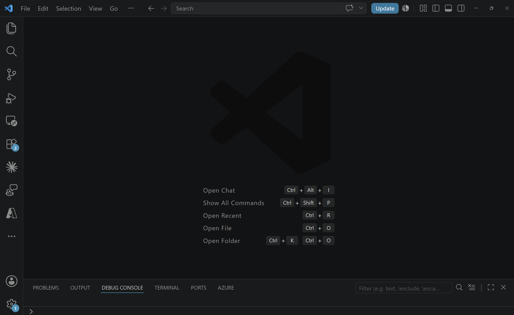
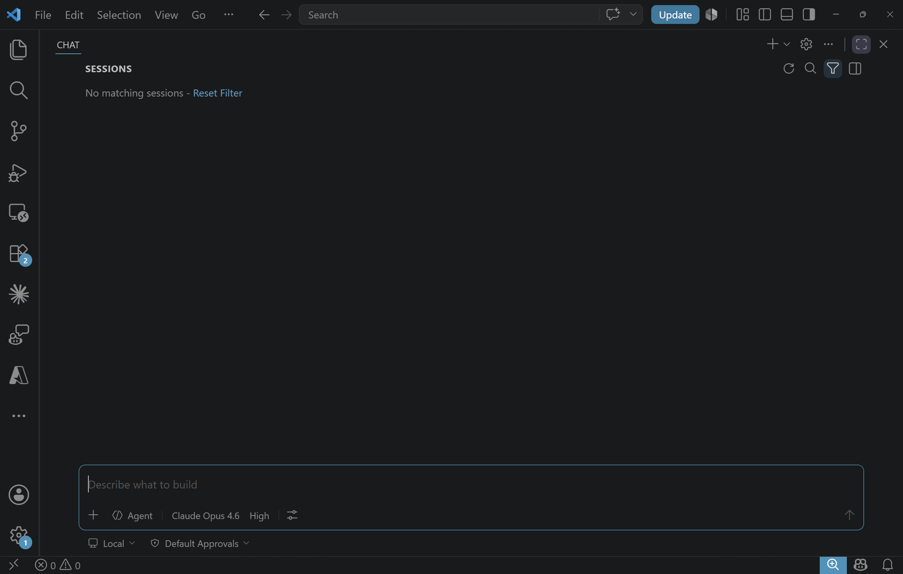

# Cost Management & Pricing tools

The Azure Resource Manager MCP server ships an optional **Cost Management & Pricing**
tool surface that lets agents answer cost, budget, savings, and pricing questions
in natural language, on behalf of the signed-in user.

These tools are **off by default** — enable them per client (see below).

## What you can ask

Once enabled, you can ask the agent things like:

- *"What did I spend on Azure this month, broken down by service?"*
- *"Forecast my subscription cost for the rest of the month."*
- *"How much would a Standard_E4s_v5 VM cost in East US?"*
- *"Show me my reserved instance utilization for the last 30 days."*

## Toolsets

The server groups tools into **toolsets**:

| Toolset          | What it includes                                                |
|------------------|-----------------------------------------------------------------|
| `CostManagement` | Cost & usage queries, budgets, alerts, savings, AKS cost split  |
| `Pricing`        | Public retail prices and negotiated pricesheet downloads        |

## Enabling the toolsets

Opt in per client by adding the `x-mcp-toolset` header on the MCP connection to
the Azure Resource Manager MCP server. The header value is a comma-separated list
of toolset names — enable one or both, e.g. `x-mcp-toolset: CostManagement,Pricing`.

### VS Code (GitHub Copilot Chat)

MCP servers are configured in one of two files:

- **Workspace**: `.vscode/mcp.json` in your repo (applies only to that workspace).
- **User**: open the Command Palette (<kbd>Ctrl+Shift+P</kbd> / <kbd>Cmd+Shift+P</kbd>),
  run **MCP: Open User Configuration**, and edit the `mcp.json` it opens.
  On Windows this lives at `%APPDATA%\Code\User\mcp.json`, on macOS at
  `~/Library/Application Support/Code/User/mcp.json`, on Linux at
  `~/.config/Code/User/mcp.json`.

Add (or update) the Azure Resource Manager MCP server entry with `headers`:

```jsonc
{
  "servers": {
    "azure-resource-manager-mcp": {
      "type": "http",
      "url": "https://mcp.management.azure.com",
      "headers": {
        "x-mcp-toolset": "CostManagement,Pricing"
      }
    }
  }
}
```

Save the file, then restart the server: open the Command Palette and run
**MCP: List Servers**, pick `azure-resource-manager-mcp`, and choose **Restart**.
The new tools will appear under **Configure Tools** in Chat.



### GitHub Copilot CLI

Edit `~/.copilot/mcp-config.json` and add (or update) the server entry with `headers`:

```jsonc
{
  "mcpServers": {
    "azure-resource-manager-mcp": {
      "type": "http",
      "url": "https://mcp.management.azure.com",
      "headers": {
        "x-mcp-toolset": "CostManagement,Pricing"
      }
    }
  }
}
```

Restart the MCP server to pick up the change. In Copilot CLI today this means
exiting and relaunching `copilot`. Verify the server is running with
`copilot mcp list`.

## Cost Management tools

Toolset: `CostManagement`

### Query & forecast

| Tool              | Purpose                                                   |
|-------------------|-----------------------------------------------------------|
| `query_costs`     | Query Azure cost and usage data.                          |
| `query_aks_costs` | Query AKS container-level cost data.                      |
| `forecast_costs`  | Forecast Azure costs.                                     |
| `list_dimensions` | List available cost dimensions for grouping or filtering. |

### Budgets & alerts

| Tool                  | Purpose                                       |
|-----------------------|-----------------------------------------------|
| `list_budgets`        | List Cost budgets.                            |
| `get_budget`          | Get details for a single Cost budget.         |
| `create_budget`       | Create a Cost budget. *(write)*               |
| `list_alerts`         | List cost alerts and anomalies.               |

### Reservations & Savings Plans

| Tool                            | Purpose                                                    |
|---------------------------------|------------------------------------------------------------|
| `list_benefit_utilization`      | Show Reservation and Savings Plan utilization.             |
| `get_benefit_recommendations`   | Get Reservation and Savings Plan purchase recommendations. |
| `list_reservation_transactions` | List Reservation and Savings Plan transactions.            |

## Pricing tools

Toolset: `Pricing`

| Tool                        | Purpose                                                                |
|-----------------------------|------------------------------------------------------------------------|
| `get_retail_prices`         | Look up public Azure retail prices for any service, SKU, and region.   |
| `start_pricesheet_download` | Start an asynchronous download of your negotiated pricesheet.          |
| `get_pricesheet_status`     | Poll the status of a pricesheet download and get the download URL.     |

> **Pricesheet scope:** `start_pricesheet_download` and `get_pricesheet_status`
> require an **Enterprise Agreement (EA)** or **Microsoft Customer Agreement
> (MCA)** billing scope. `get_retail_prices` works for everyone.

## Example: a pricing prompt end-to-end

Asking *"How much would an Av2 VM cost per month in East US?"* — the agent calls
`get_retail_prices` and returns a breakdown across OS and pricing tiers
(Regular vs Spot, Linux vs Windows):


