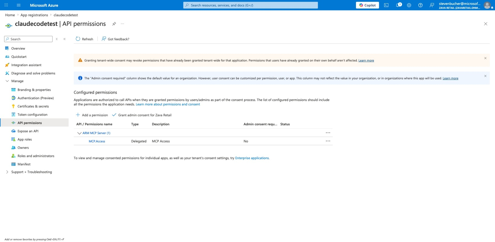
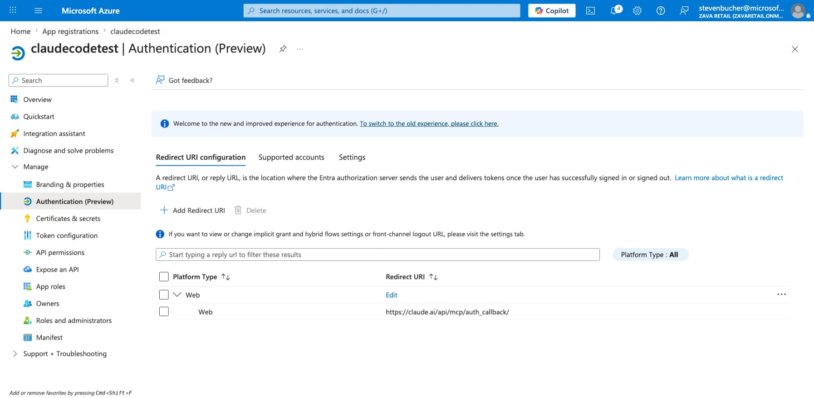
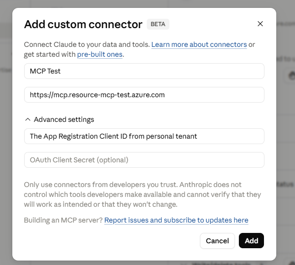
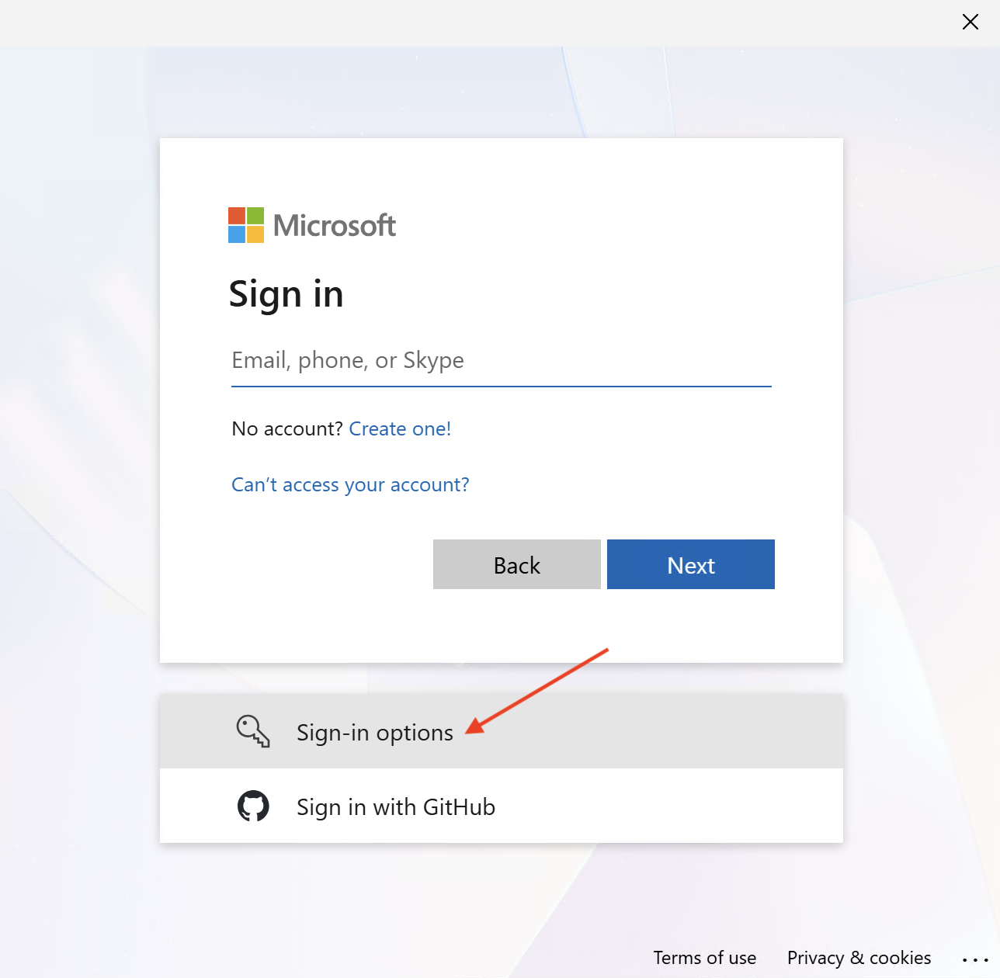
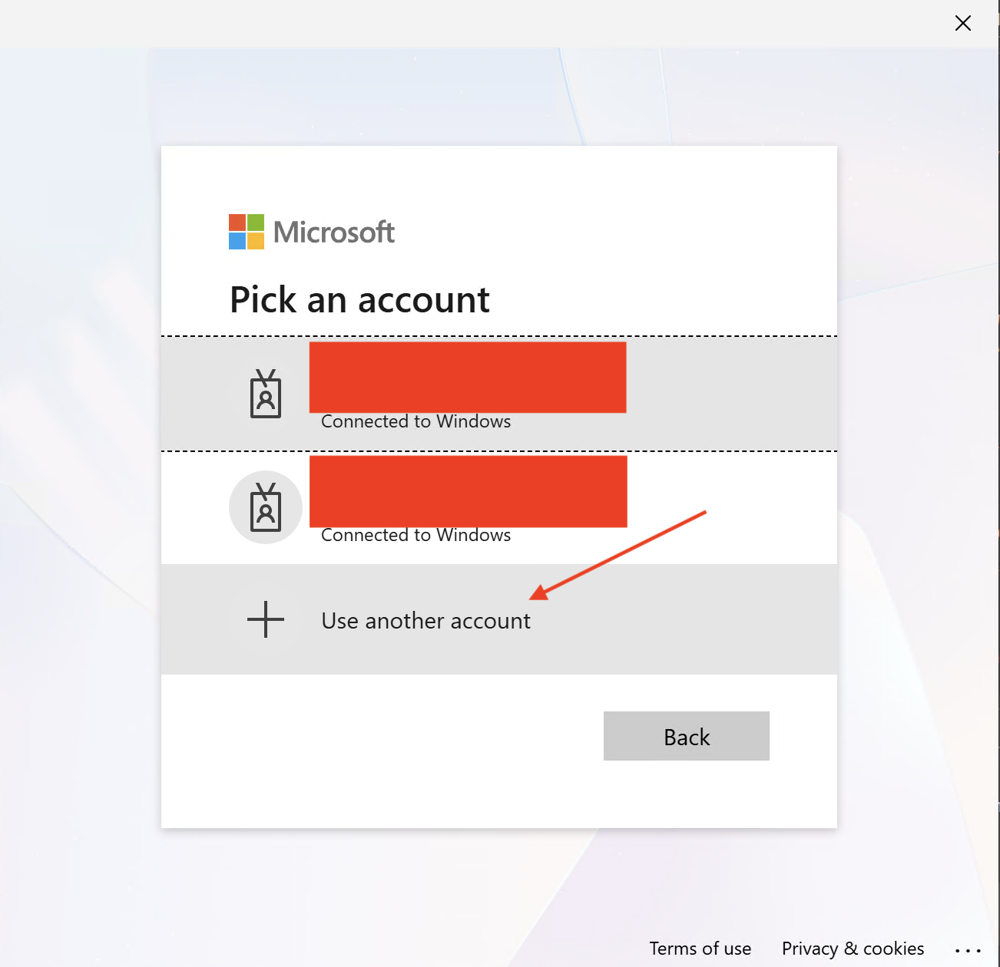
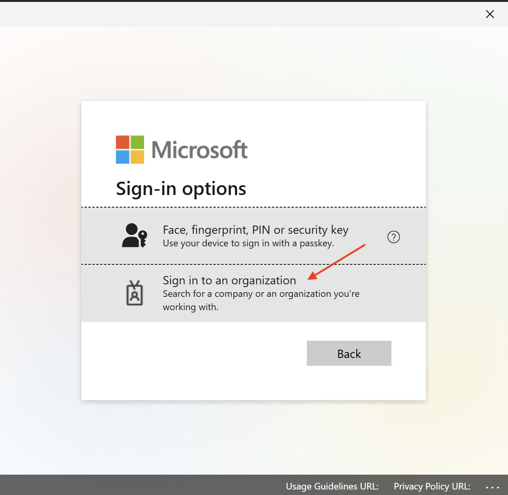
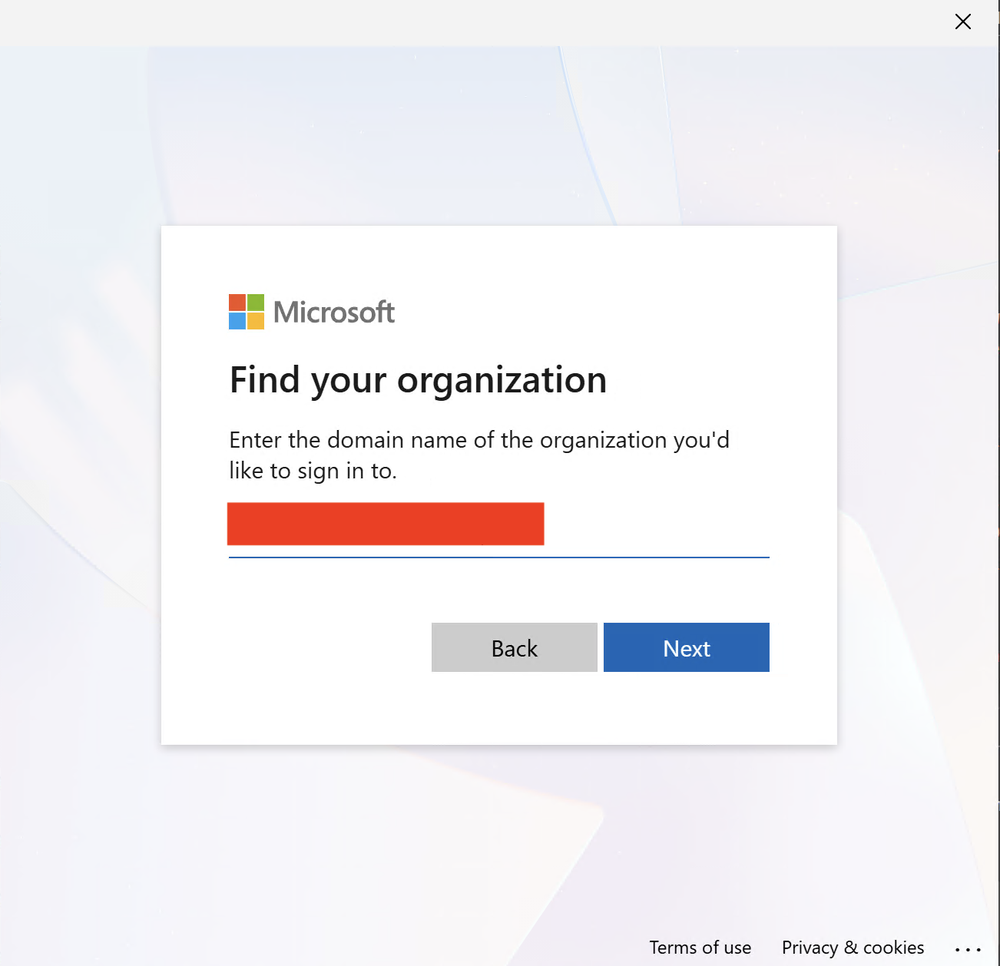

# Other client support (App registrations)

Use these steps to configure a 3rd-party client with Azure Resource Manager MCP server access.

## 1. Create an app registration

In **Microsoft Azure > App registrations**, create a new app registration for your client.

## 2. Update `manifest.requiredResourceAccess`

Manually add the following entries:

```json
[
  {
    "resourceAppId": "22bfbae3-f4e7-485f-be43-8cee15065084",
    "resourceAccess": [
      {
        "id": "601b3b64-a3c4-4faa-ab9c-8f97ba332aa3",
        "type": "Scope"
      }
    ]
  }
]
```

After saving the manifest, the **API permissions** page should look like this:



## 3. Configure redirect URI

Under App Registration><your-app-registration>>Manage>Authentication (Preview), add a Web Redirect URI to `https://claude.ai/api/mcp/auth_callback/`.



## 4. Create service principals

Open up CloudShell and use the following command to create service principals:

```bash
az ad sp create --id 22bfbae3-f4e7-485f-be43-8cee15065084
```


## 5. Create a client secret

Create a new client secret under App Registration><your app registration>>Manage>Certificates and secrets>Client secrets. Copy the **secret value** (not the secret ID).

You will use this value in your Claude Code custom connector definition.

## 6. Set configuration for Claude Code

Now use the ARM MCP endpoint, Application ID, the Client Secret to configure your Claude custom connector.



## 7. Logging in

You will then have to connect the tool to your Azure account. Choose "Connect" and follow the prompts to sign in.

**Note:** The account you use must have at least Owner permissions on at least one subscription for the tools to work properly. The account will always default to the home tenant of the account.

To switch the tenant you want to use you will have to disconnect the current account and sign in a different way:

When re-connecting to the tool, during the sign-in process:
1. Choose "Other Sign in option" 

or if you have accounts saved already choose "Sign in with another account"


3. Choose "Sign in to an organization" 


4. Enter your domain name


5. Select the account to log in to 


