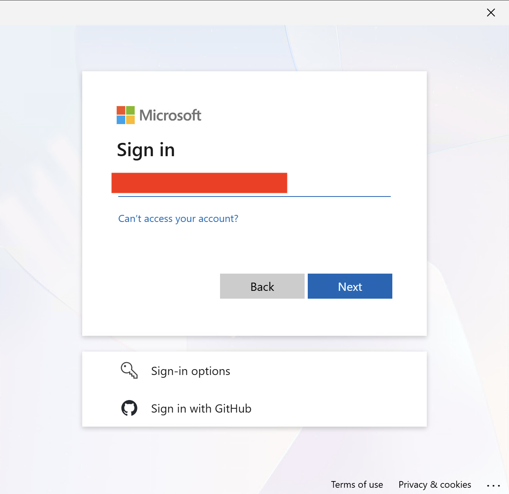

## Troubleshooting Guide

This guide covers common issues customers may encounter when using the Azure Resource Manager MCP server, with practical steps to diagnose and resolve them.

## Quick Checks

Before deep troubleshooting, confirm the following:

1. The Azure Resource Manager MCP server is installed and enabled in VS Code.
2. You are signed in with an account that you have access to the intended Azure tenant and subscriptions.
3. The required tools are enabled in the MCP server configuration.

## Authentication Issues

### Personal account issues

You may run into a `AADSTS500200` error when you try to sign in with a personal account.

The first easy way to solve this is to switch to an organizational account that has access to the Azure tenant you want to query. 

If you don't have one, you can invite your personal account as a guest user to the tenant and use it that way.

1. Invite the user as a guest user to the tenant you want to access.`
3. Accept the guest invitation
4. Make sure the account has Write permissions on the subscription you want to query against.
5. When you sign in choose "Sign in Options"

6. Choose "Sign in to an organization" 

7. Enter the domain of your organization

9. Select add a new account 

10. Sign in with the email of the guest account you created

Organizational accounts generally provide a more predictable authentication and authorization
experience across tenants and enterprise policies. We recommend prioritizing organizational account
access.

### Conditional Access

If your tenant uses Conditional Access and Security Defaults are disabled, you may experience
unexpected authentication errors in some sign-in or tool invocation flows. If you encounter this,
please open a GitHub issue in this repository.

## Tool Invocation Order and LLM Client Behavior

Sometimes tools are called in an unexpected or inconsistent order when using different AI clients,
leading to unexpected outcomes.

Different client LLMs may choose different tool invocation strategies. For example, sometimes
without explicit instructions, a LLM may skip validation or execute tools in a non-ideal sequence.

To improve reliability, we recommend guiding the LLM with explicit instructions on the preferred
tool invocation order. For example, when working with ARG queries, instruct the LLM to always use
`generate_query` first, then `validate_query`, and only proceed to `execute_query` if validation
succeeds. This can help catch issues early and prevent executing invalid queries.

To reduce variability across clients, define a default system prompt or policy guidance in your
client configuration. For example:

"Always validate generated Azure Resource Graph queries before executing them. Use `generate_query`,
then `validate_query`, and execute only if validation succeeds."

## When to Escalate

If issues persist after these steps, collect and share:

1. The tool call sequence used.
2. Relevant error messages, traceID, and timestamps.
3. Tenant/subscription context (without sharing sensitive secrets).
4. Whether the account is personal, guest, or organizational.

Include this information when opening an issue so support can reproduce and triage quickly. Open an
issue in this repository with the details above, and we will investigate further.
